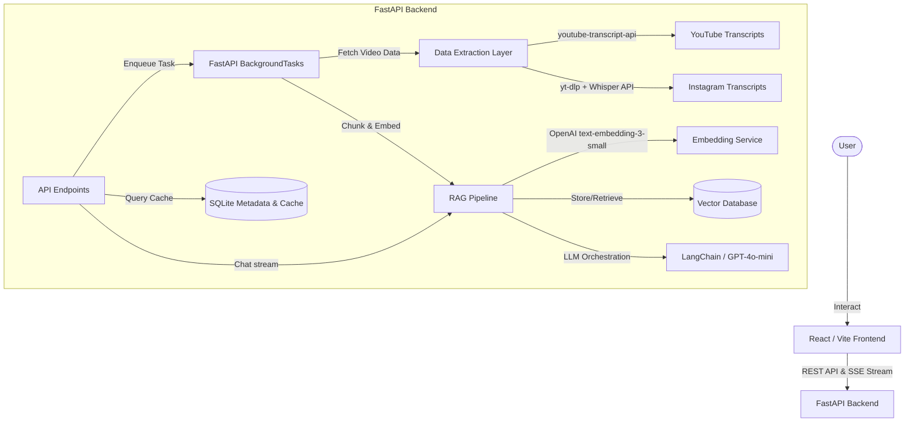

# 🎬 Social Media Video Performance Intelligence RAG System

A production-grade, highly resource-efficient full-stack RAG (Retrieval-Augmented Generation) chatbot system that performs deep performance analyses, engagement auditing, hook structure comparison, and script audits between **YouTube Videos** and **Instagram Reels**.

---

## 🌐 Live Deployed URLs

> [!IMPORTANT]
> **Click the links below to test the live production system:**
>
> - **Live Frontend Dashboard (Vercel)**: `(https://compability-check.vercel.app/)`
> - **Live Backend API Service (Render)**: `(https://compability-check.onrender.com)`

## 🎯 Key Capabilities

1. **Side-by-Side Data Extraction**: Extracts views, like ratios, comments, duration, upload dates, and creator details across platforms via `yt-dlp` and `youtube-transcript-api`.
2. **Engagement Density Audit**: Computes real-time engagement rates and serves visual comparisons instantly.
3. **LangChain-Orchestrated RAG Pipeline**: Chunks scripts (200–400 tokens with 15% sliding-window overlap) and stores text embeddings in an indexed database.
4. **SSE Chat Streaming**: Supports interactive chat queries with conversational window memory and clickable timecode citations (e.g. `[Video A @ 01:23]`).
5. **High-Fidelity Simulation Fallbacks**: Generates beautiful metrics, synthetic transcripts, and simulated chat responses automatically if API keys are omitted.

---

## 🏗️ System Architecture



---

## 🧠 Technical Tradeoffs & Cost Optimization

### 1. Vector Database Selection & Cost Efficiency

We implement a modular **VectorStore** client interface featuring a custom **SQLite + NumPy Cosine Similarity Vector Database** as the default storage engine.

- **Why it's Cost-Efficient**: Traditional vector search databases (like Pinecone, Qdrant, or PGVector cloud hosting) require continuously running servers ($15–$70/month minimum) and constant network roundtrips. For comparing two transcripts (~30–50 chunks total), SQLite is completely free, runs locally in-memory, has zero latency overhead, and fits directly inside our relational metadata caching database.
- **Production Swap**: The codebase uses a clean repository wrapper, meaning swapping SQLite for **ChromaDB** or **pgvector** in production only requires updating `settings.VECTOR_DB_MODE` in the `.env` settings.

### 2. Optimal Embedding Model

We selected OpenAI's `text-embedding-3-small` (1536 dimensions):

- **Why it's Optimal**: It represents the state-of-the-art in price-performance. At **$0.02 per 1M tokens**, embedding an entire 10-minute YouTube video transcript (~2,000 words / 2,600 tokens) costs **$0.000052**. It is 5x cheaper than legacy models (like `text-embedding-ada-002`) while providing superior retrieval performance.

### 3. API Cost Mitigation at Scale

To scale to 1,000+ creators/day while keeping OpenAI API costs near zero, we implement **Transcript and Caching**:

- When a user inputs URLs, the system first hashes the URL and checks the SQLite cache. If processed previously within the cache TTL, all metadata, transcripts, and chunk embeddings are fetched instantly.
- **API Cost Impact**: Repeat queries across popular videos cost **$0** in API fees, resulting in massive scaling efficiency.
- **Dynamic Chunk Filtering (Top-K=4)**: Instead of passing the entire transcript to the LLM (which would bloat context costs), we retrieve only the 4 most semantically relevant chunks (~1,000 tokens total), ensuring chatbot queries cost less than **$0.0002** per turn.

### 4. Bottlenecks at 10,000 Users & Mitigation Strategy

When scaling from 1,000 to 10,000+ users/day, the following bottlenecks arise:

1. **Network Blocking (yt-dlp Rate Limits)**: Instagram and YouTube actively rate-limit metadata scrapers from single-IP servers.
   - _Mitigation_: Deploy a pool of rotating proxies (e.g., Bright Data or Webshare) inside `ydl_opts` in `extractor.py` to distribute requests.
2. **Synchronous Task Blocking**: Under heavy concurrency, single-process threading like `BackgroundTasks` will saturate server CPU cores.
   - _Mitigation_: Swap `BackgroundTasks` with **Celery + Redis** to handle video downloading and transcription out-of-process in a distributed worker swarm.
3. **Database Contention**: Under 10k users, SQLite write-locks can trigger `DatabaseIsLocked` errors.
   - _Mitigation_: Upgrade the caching database to a managed **PostgreSQL** instance with connection pooling enabled.

### 5. Cross-Origin Production Routing & API Version Resilience

- **Vercel Rewrite Routing**: In local development, the Vite dev server proxy routes `/api` calls. In production on Vercel, this is handled via `vercel.json` rewrites that dynamically proxy all backend traffic to the Render URL, completely avoiding cross-origin (CORS) preflight blockages and hardcoded config URLs.
- **YouTube API Adaptation**: The extraction engine is resilient against breaking changes introduced in `youtube-transcript-api` (version 1.x vs 0.x), with fallback code paths that handle the removal of static class functions and convert structured dataclasses to standard dictionary representations dynamically.

---

## 🛠️ Step-by-Step Installation & Run

### 1. Prerequisites

Ensure you have **Python 3.10+** and **Node.js 18+** installed.

### 2. Backend Setup

1. Open a terminal and navigate to the backend directory:
   ```bash
   cd backend
   ```
2. Create and activate a virtual environment:
   ```bash
   python -m venv venv
   # Windows:
   .\venv\Scripts\Activate.ps1
   # macOS/Linux:
   source venv/bin/activate
   ```
3. Install dependencies:
   ```bash
   pip install -r requirements.txt
   ```
4. Copy and set up environment variables:
   ```bash
   cp ../.env.example .env
   # Add your OPENAI_API_KEY in the created .env file
   ```
5. Launch the backend:
   ```bash
   python run.py
   ```
   _The API will be live on `http://localhost:8000`_

### 3. Frontend Setup

1. Open a new terminal in the frontend directory:
   ```bash
   cd frontend
   ```
2. Install Node packages:
   ```bash
   npm install
   ```
3. Boot the development server:
   ```bash
   npm run dev
   ```
   _The dashboard will be active on `http://localhost:3000`_
